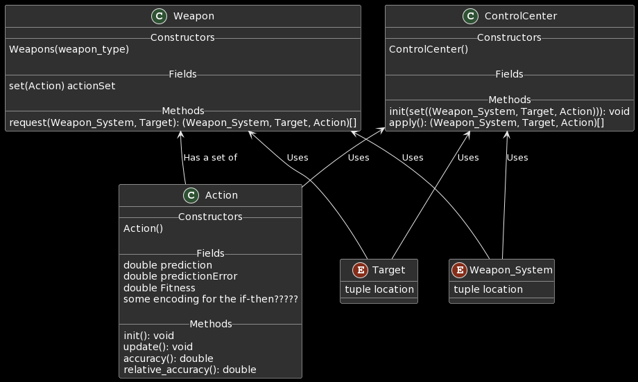

The following is a proposed algorithm for the competition, based on the immunized genetic algorithm and harmony search idea we had. 

## Terminology
- Target: An enemy projectile we want to take down.
- Units: Our friendly ships.

## Algorithm

This is how we will initialize our AI:
```python
# make a new weapon A.I. object for each weapon_type
# in this competition, WEAPON_TYPES = ["Cannon", "Chainshot"]
weapon_AIs = dict()
for weapon_type in WEAPON_TYPES:
    weapon_AIs[weapon_type] = Weapon_AI(weapon_type)
    
control_center = ControlCenter()
```


This is the algorithm that we will run at each step:
```python
# create set of possible actions against target
target_actions = list()

for target in statePb.Tracks:
    current_target_actions = set()
    for defense_ship in statePb.assets:
        for weapon in defense_ship.weapons: 
            # get a set of proposed ( weapon, defense_ship, target ) tuples for the target
            proposed_actions = weapon_AIs[weapon.SystemName].request(weapon, defense_ship, target)
            possible_target_actions.add(proposed_actions)
    target_actions.append(current_target_actions)
    
# initialize and apply immune system dynamics to get the top Actions
ControlCenter.init(possible_target_actions)
best_actions = ControlCenter.apply()

#execute the best actions to get a reward
reward = execute(best_actions)
```

If we are training the algorithm, we will use the ```reward``` variable and ```best_actions``` variable to update the fitness values for each ```Action_Rule``` that was executed, and use either Genetic Algorithm or Harmony Search to fine tune the ```Action_Rule``` objects. 

```python
for action in best_actions:
    action.update(reward)

# do Genetic Algorithm OR Harmony Search here!
```
## Training
The goal of using the genetic algorithm and harmony search is to discover the right ```Action_Rule``` class conditionals to use and the right hyperparameters to use to select the right ```Action_Rule``` at any step.  

## Variables/Main Ideas

### The ```Weapon_AI``` Class
A specific instance of a ```Weapon_AI``` class handles decision making for a specific type of weapon. For example, since we have ```Chainshot``` and ```Cannonball``` as the two types of weapon systems at our disposal, we would have a ```Weapon_AI``` object in charge of ```Chainshot``` logic, and another in charge of ```Cannonball``` logic. 

This class is analogous to the B-cell from the immunized classifier paper. 

The constructor for this class initializes a set of 

Each weapon in-game can make a request to the ```Weapon_AI``` object that corresponds to its weapon type. From its parameters, the ```request()``` function has access to the location, direction, threat-level, and type of a target and the location/capabilities of the specific weapon, and will choose an appropriate subset of its ```Action_Rule``` objects having conditionals that match the situation. It will return a set of tuples of the following format: ( weapon_system, ship, target, ```Action_Rule``` ). After compiling this set of tuples, the ```request()``` function will use the following formula to calculate expected action payoff values for the subset of this ```Weapon_AI``` object's ```Action_Rule``` set that applies to this target. 

### The ```Action_Rule``` Class
Each ```Action_Rule``` object is a wrapper around a specialized if-then statement. It has a set of conditionals describing the state of units and ships. 

This is analogous to the classifier from the immunized classifer paper. 

An ```Action_Rule``` object could look like this: "IF distance from target IS low AND velocity IS medium AND heading IS high THEN fire".

It is also the candidate that the genetic algorithm will evolve over time, and also contains pertinent variables. These variables are outlined below, with their update functions. These update functions will be called with the ```Action_Rule``` class' ```update()``` function. 
- Prediction $cl.p: cl.p = cl.p + \beta(R-cl.p)$
- Prediction Error  $cl.\epsilon : cl.\epsilon = cl.\epsilon + \beta(|R-cl.p| - cl.\epsilon)$, where $R$ is the reward associated with performing a specific action. 
- Fitness $cl.F : cl.F = cl.F + \beta(\hat{\lambda}(cl) - cl.F)$
- Accuracy $\lambda(cl)$, where $\epsilon_0$ is an accuracy criterion constant. A classifier is accurate if $cl.\epsilon$ is smaller than $\epsilon_0$. $\alpha$ and $v$ are hyper-parameters used to control the rate at which the accuracy reduces. 

$$\lambda (cl) = \begin{cases} 
1 & \text{if } cl.\epsilon < \epsilon_0 \\ 
\alpha(\frac{cl.\epsilon}{\epsilon_0})^{-v} & \text{if } cl.\epsilon \geq \epsilon_0 \end{cases}$$

- Relative accuracy $\hat{\lambda}(cl): \hat{\lambda}(cl) = \frac{cl.n \times \lambda(cl)}{\sigma_{cl_b \in [A]} \lambda(b) \times b.n}$

### The ```ControlCenter``` Class
The control center takes a set of all proposed (weapon_system, target, ```Action_Rule```) tuples and selects the optimal ones to use. To choose the right ```Action_Rule``` objects to take, the ControlCenter could use immune network dynamics. 

Using ```init(possible_actions)```, we pass a set of tuples of the format ( weapon_system, target, ```Action_Rule``` ) so that the ControlCenter can link tuples of the same target together.

Then, once ```apply()``` is called, it will apply immune network dynamics and return a list of the best ```Action_Rule``` for each target. The following system of ODEs governs immune network dynamics: 
For ```Action_Rule``` $a_i$ at time $t$, we have:

$$\frac{da_i(t+1)}{dt} = \left( \alpha \sum^{N}_{j=1} m_{ji} a_j(t) - \beta \sum^{N}_{j=1} m_{ik} a_k(t) + \gamma m_i - k \right) a_i(t)$$

- $N$ is the number of ```Action_Rule``` objects that deal with the target
- $m_i$ is the affinity between ```Action_Rule``` $i$ and the target antigen
- $m_{ji}$ is the mutual stimulus coefficient of ```Action_Rule``` $j$ on ```Action_Rule``` $i$
- $m_{ki}$ is the inhibitory effect of ```Action_Rule``` $k$ on ```Action_Rule``` $i$
- Hyperparameter $k$ is the natural death rate of ```Action_Rule``` $i$
- $a_i(t)$, $a_j(t)$, and $a_k(t)$ are bounded scores that are imposed on the ```Action_Rule``` objects
- coefficients $\alpha$, $\beta$, and $\gamma$ are hyperparameters that determine the significance of each term. 

The solution to this set of ODE's will yield the score for each ```Action_Rule```, and the top one for each target is chosen to be executed.

### UML Diagram


Here is a UML diagram of the proposed classes, there might be some missing fields/methods. 
